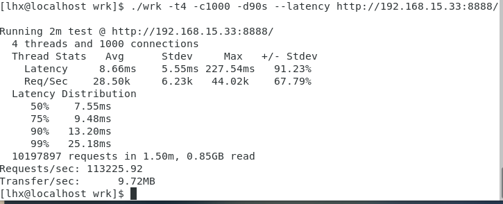
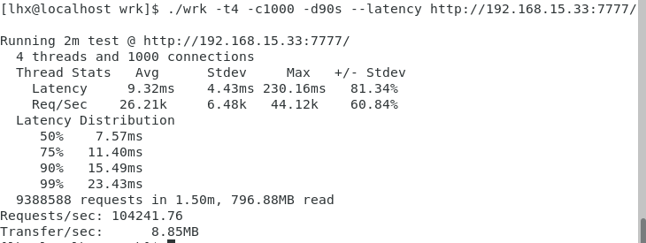

# ZEDIO 
[](https://isocpp.org/)
[](https://www.kernel.org/)  

ZEDIO是一个异步运行时框架，用于使用C++编写异步应用程序。
```
  ______  ______   _____    _____    ____  
 |___  / |  ____| |  __ \  |_   _|  / __ \ 
    / /  | |__    | |  | |   | |   | |  | |
   / /   |  __|   | |  | |   | |   | |  | |
  / /__  | |____  | |__| |  _| |_  | |__| |
 /_____| |______| |_____/  |_____|  \____/ 
                                                                       
```
# 1.操作系统环境
ubuntu23.04
# 2.如何使用
## 2.1.编译器
- g++ 13.1.0
## 2.2.安装以及编译
zed 是 HEADER ONLY，你可以直接cp zed文件夹到你的项目中。或者通过CMake安装。
1. clone zedio
```
gitclone https://github.com/8sileus/zedio
cd zedio
mkdir build
cd build
```
2. install
```
cmake --install . # --prefix ./user_defined_install_path 
```
3. compile tests
```
cmake --build . # -j num_thread
ctest .
```

# 3.简单echo server
``` C++
// 去除所有检查
auto process(TcpStream stream) -> Task<void> {
    char buf[1024];
    while (true) {
        auto len = co_await stream.read(buf, sizeof(buf)).value();
        if (len == 0) {
            break;
        }
        co_await stream.write(buf, len);
    }
}

auto accept() -> Task<void> {
    auto addr = SocketAddr::parse("localhost", 8888).value();
    auto listener = TcpListener::bind(has_addr).value();
    while (true) {
        auto has_stream = co_await listener.accept();
        if (has_stream) {
            spwan(process(std::move(has_stream.value())));
        } else {
            console.error(has_stream.error().message());
            break;
        }
    }
}

int main() {
    Runtime runtime;
    runtime.block_on(accept());
}
```
# 4.当前特性
- 实现多线程工作窃取并发模型 基于rust的tokio
- 封装IOURING,使用co_await异步执行IO
- 使用std::expected和std::opitional做错误处理
- 异步日志库，编译时指定ZED_LOG，获取ZEDIO的运行日志
- 支持协程链式执行
    ``` C++
    auto test_spwan_chain(std::string_view str) -> Task<void> {
        LOG_INFO("test spwan chain {}", str);
        co_return;
    }
    spwan(test_spwan_chain("hello"), test_spwan_chain("world"));
    ```
- 实现定时器，支持延迟调用 //已完成定时器，细节待定。

# 5.性能对比tokio
测试环境：  
VM虚拟机   
操作系统：Ubuntu23.04  
核心：4    
内存：4G 
处理器：AMD Ryzen 5 3600 6-Core Processor  				
测试指令：./wrk -t4 -c1000 -d90s --latency http://192.168.15.33:7777/   
ZEDIO:

TOKIO:



# 6.依赖
boost: https://github.com/boostorg/boost   
liburing: https://github.com/axboe/liburing

