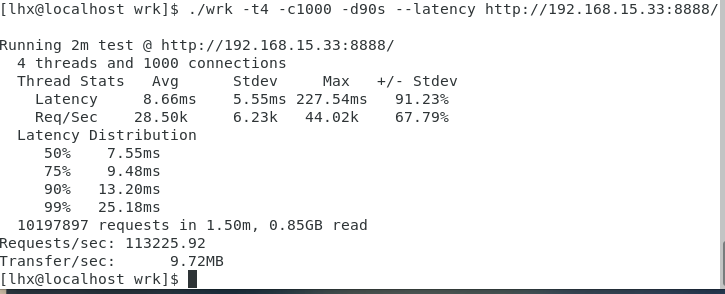
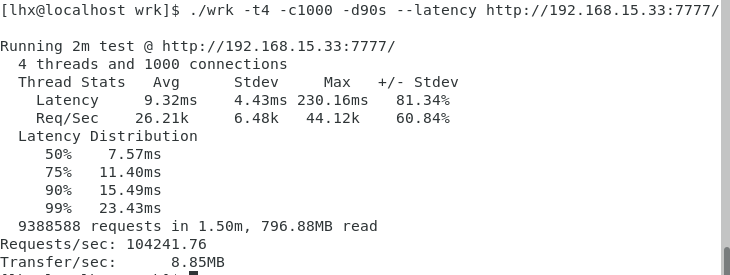

# ZEDIO 
[](https://isocpp.org/)
[](https://www.kernel.org/)  

ZEDIO是一个异步运行时框架，用于使用C++编写异步应用程序。
```
  ______  ______   _____    _____    ____  
 |___  / |  ____| |  __ \  |_   _|  / __ \ 
    / /  | |__    | |  | |   | |   | |  | |
   / /   |  __|   | |  | |   | |   | |  | |
  / /__  | |____  | |__| |  _| |_  | |__| |
 /_____| |______| |_____/  |_____|  \____/ 
                                                                       
```
# 1.操作系统环境
ubuntu23.04
# 2.如何使用
## 2.1.编译器
- g++ 13.1.0
## 2.2.安装以及编译
zed 是 HEADER ONLY，你可以直接cp zed文件夹到你的项目中。或者通过CMake安装。
1. clone zedio
```
gitclone https://github.com/8sileus/zedio
cd zedio
mkdir build
cd build
```
2. install
```
cmake --install . # --prefix ./user_defined_install_path 
```
3. compile tests
```
cmake --build . # -j num_thread
ctest .
```

# 3.简单echo server
``` C++
// 去除所有检查
auto process(TcpStream stream) -> Task<void> {
    char buf[1024];
    while (true) {
        auto len = co_await stream.read(buf, sizeof(buf)).value();
        if (len == 0) {
            break;
        }
        co_await stream.write(buf, len);
    }
}

auto accept() -> Task<void> {
    auto addr = SocketAddr::parse("localhost", 8888).value();
    auto listener = TcpListener::bind(has_addr).value();
    while (true) {
        auto has_stream = co_await listener.accept();
        if (has_stream) {
            spwan(process(std::move(has_stream.value())));
        } else {
            console.error(has_stream.error().message());
            break;
        }
    }
}

int main() {
    Runtime runtime;
    runtime.block_on(accept());
}
```
# 4.使用手册
## 4.1.如何创建一个异步任务
```C++
    using zed::async::Task;
    auto f() -> Task<void>{}
```
## 4.2.如何启动一个异步任务
```C++
    // 第一种方式，当前线程or协程不会阻塞。
    spwan(f());

    //第二种方式 在一个协程里，co_await语法调用，当前协程会阻塞，直到f()执行完毕。
    auto t()->Task<void>{
        co_await f();
    }
```
## 4.3.如何启动一个定时任务
```C++
    auto cb=[](){};
    // 意思是延迟0s第一次执行cb，然后每隔1s执行一次。
    // handle可以用来关闭定时任务。
    auto handle=add_timer_event(cb,0s,1s);
    handle.cancel();
```
## 4.4.链式执行异步任务
```C++
    auto a()->Task<void>{}

    auto b()->Task<void>{}

    auto c()->Task<void>{}

    //第一种方式 可变参数模板调用
    spwan(a(),b(),c());

    //第二种方式 直接协程里co_await
    auto a()->Task<void>{
        co_await b;
    }
    auto b()->Task<void>{
        co_await c;
    }
    auto c()->Task<void>{
        // do something
    }
```
## 4.5.对IO操作进行限时
```C++
    using zed::async::timeout;
    auto ok = co_await timeout(stream.read(buf, sizeof(buf)), 5s);
    if (ok) {
        // ok!
    } else {
        // timeout!
    }
```
## 4.6.协程级睡眠
```C++
    using zed::async::sleep;
    co_await sleep(3s);
```

# 5.性能对比tokio
测试环境：  
VM虚拟机   
操作系统：Ubuntu23.04  
核心：4    
内存：4G  
处理器：AMD Ryzen 5 3600 6-Core Processor  
测试指令：./wrk -t4 -c1000 -d90s --latency http://192.168.15.33:7777/   
ZEDIO:  
  
TOKIO:  
  


# 6.依赖
boost: https://github.com/boostorg/boost   
liburing: https://github.com/axboe/liburing

