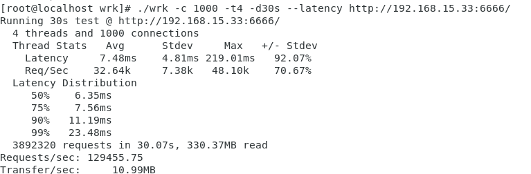
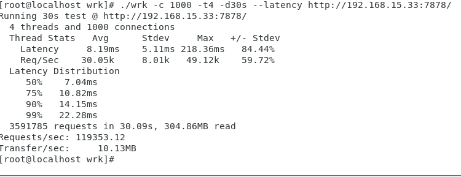

# Performance comparison

These performance test results are not absolute, they are only on my machine, If you want to test it yourself, you can find the source code in [benchmark](./benchmark)

## Server configuration
- OS：Ubuntu23.04  
- Number of cores: 4    
- Memory: 4G  
- CPU: AMD Ryzen 5 3600 6-Core Processor  
## Results
Test tool: wrk  
Command: ./wrk -t4 -c1000 -d90s --latency  
- ZEDIO:    
  
- TOKIO:    
  
- MONOIO:  
 
- GOLANG:  
  
